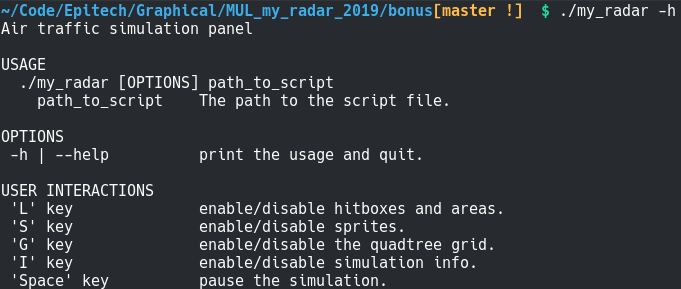
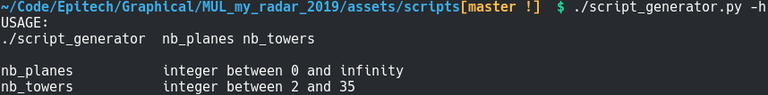
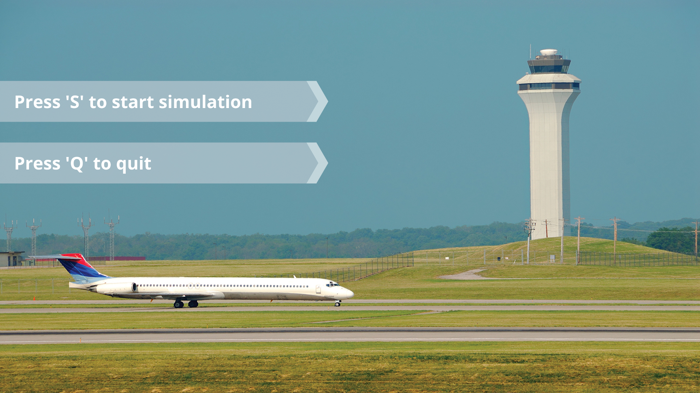
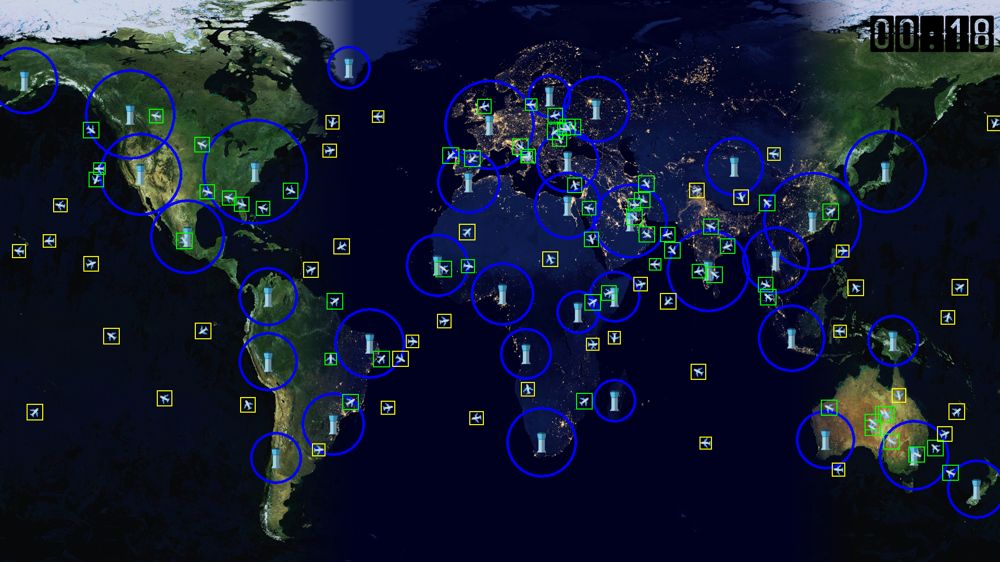

## my_radar

- [Description](#description)
- [Usage](#usage)
- [Screenshots](#screenshots)

### Description

my_radar is an air traffic graphical simulation.
Planes fly from a control tower to another, and reset when they reach their
destination or collide with one another.
Two planes colliding within a tower control area are not destroyed and can
continue on their way.

I used an [AABB](https://www.youtube.com/watch?v=59BTXB-kFNs) (Axis Aligned
Bounding Box) algorithm for collision detection and a [quadtree](https://www.youtube.com/watch?v=OJxEcs0w_kE) spatial
partitionning to reduce the number of checks per plane.

The root version of this project is used for my Epitech delivery and contains no banned functions. Please use the version located in the bonus directory if you wish to use all features, which includes :
- a start menu
- displaying the quadtree
- a day and night cycle
- pausing the simulation

### Usage

A script file determines the positions of the towers, the starting towers of
each plane, aswell as its speed and delay before take off.
There are scripts to test the program under the assets/scripts directory.
You can make your own with ./script_generator.py :

### Screenshots

### Video preview

[Click here to see a video preview](https://www.youtube.com/watch?v=P4hhDQJPtls)